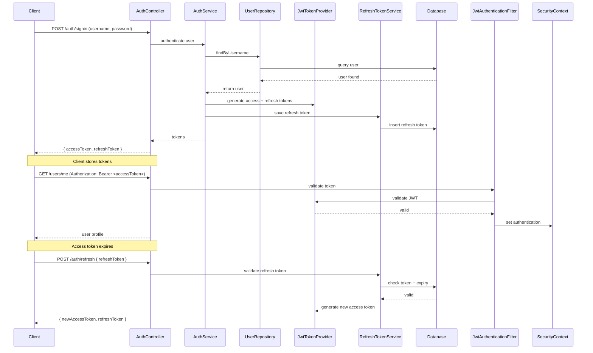

# BootGuard 🛡️

A **Spring Boot 3** template for building secure REST APIs with **JWT authentication**, **role-based authorization**, **refresh tokens**, **Liquibase migrations**, and **OpenAPI/Swagger documentation**.

This project is designed as a **starter kit** for quickly bootstrapping production-ready APIs.

---

## 🚀 Features
- Spring Boot 3 + Java 17
- JWT Authentication (access + refresh tokens)
- Role-based authorization
- User & Auth controllers
- SQLite (dev) + PostgreSQL (prod) with Liquibase migrations
- Global Exception Handling
- Consistent API responses (`ApiResponse<T>`)
- Request/Response logging
- CORS configuration
- OpenAPI/Swagger UI (`/swagger-ui.html`)

---

## 🛠️ Getting Started

### 1. Clone the repo
```bash
git clone https://github.com/blueisfresh/bootguard.git
cd bootguard
```

### 2. Configure Profiles
Profiles are managed in `application.properties`:

- **Dev (SQLite)** → default, no setup needed.
    - If you want a clean DB, delete the `resources/db` folder.
- **Prod (Postgres)** → configure in `application-prod.properties`.

Switch profiles:
```properties
spring.profiles.active=dev
# or
spring.profiles.active=prod
```

### 3. Configure JWT Secret
⚠️ **Important:** Always set a secure JWT secret before running the project.

In `application.properties`:
```properties
jwt.secret=mysupersecurekeythatismorethan32charslong123!
jwt.expiration.milliseconds=900000
jwt.refresh-token-expiration.milliseconds=604800000
```

### 4. Configure CORS
Allowed origins are set in `application.properties`:
```properties
app.cors.allowed-origins=http://localhost:3000,http://localhost:4200
```

### 5. Run the app
```bash
./mvnw spring-boot:run
```

### 6. Access Swagger UI
Open [http://localhost:8080/swagger-ui.html](http://localhost:8080/swagger-ui.html)

---

## 🔑 Authentication Flow



---

## 📂 Project Structure
```
src/main/java/com/blueisfresh/bootguard
 ├── config/        # Security, CORS, OpenAPI config
 ├── controller/    # REST controllers
 ├── dto/           # DTOs (requests, responses)
 ├── entity/        # JPA entities
 ├── exception/     # Custom exceptions + global handler
 ├── mapper/        # MapStruct mappers
 ├── repository/    # Spring Data JPA repositories
 ├── security/      # JWT, filters, services
 └── service/       # Business logic
```

---

## 🧪 Example API Responses

### ✅ Success
```json
{
  "success": true,
  "message": "User signed in successfully",
  "data": {
    "accessToken": "eyJhbGciOiJIUzI1NiIsInR5cCI6...",
    "refreshToken": "550e8400-e29b-41d4-a716-446655440000",
    "tokenType": "BEARER"
  },
  "timestamp": "2025-08-20T12:15:30.123Z"
}
```

### ❌ Failure
```json
{
  "success": false,
  "message": "Invalid or expired refresh token",
  "data": null,
  "timestamp": "2025-08-20T12:17:10.789Z"
}
```

---

## 📖 Documentation
- Swagger UI: [http://localhost:8080/swagger-ui.html](http://localhost:8080/swagger-ui.html)
- OpenAPI JSON: [http://localhost:8080/v3/api-docs](http://localhost:8080/v3/api-docs)

---

## 📝 TODO
- [ ] Add Javadoc to each file (controllers, services, entities, mappers).
- [ ] Add integration tests for `/auth/signup`, `/auth/signin`, `/auth/refresh`, `/users/me`.
- [ ] Extend README with deployment instructions (Docker, Kubernetes, etc.).